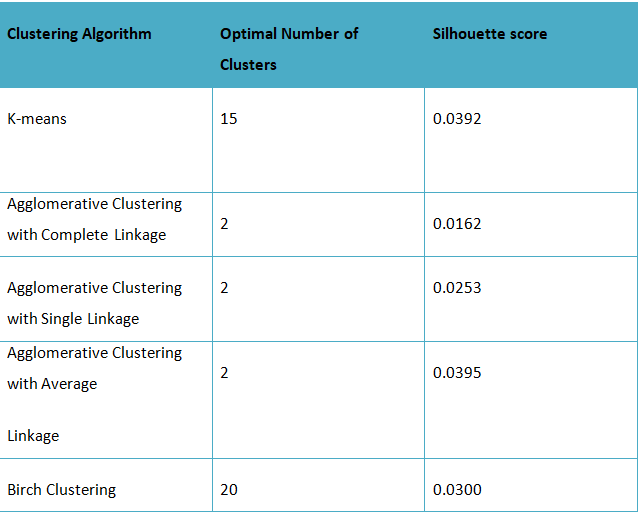
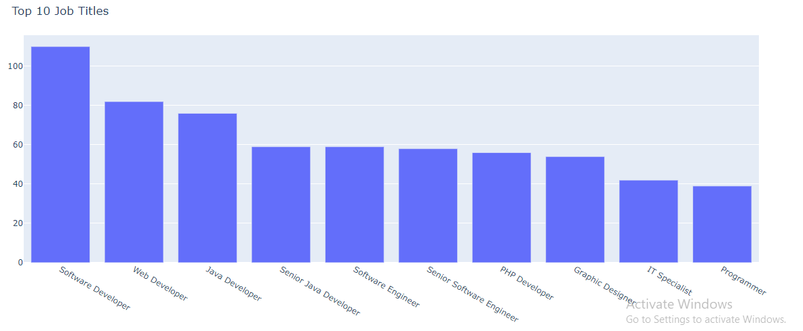
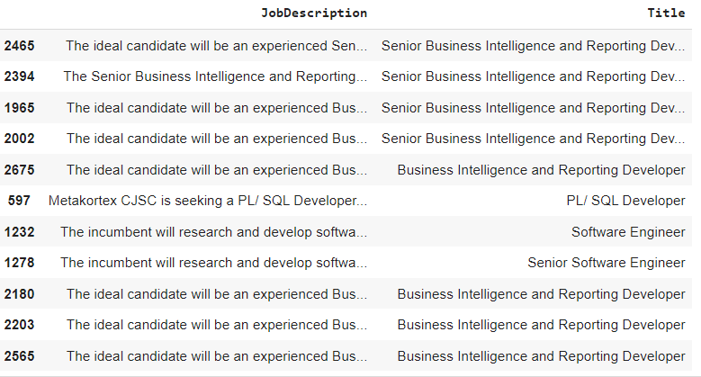

***Job Recommendation System***

***Project Description***

The job market is continuously evolving with an increasing number of job postings and

the need to attract the right talent. Job seekers face difficulty in finding the right job 

that aligns with their skills and preferences. On the other hand, recruiters face challenges in

identifying the most suitable candidates for a job position.To solve this problem,we

developed a job recommendation model that aims to provide job seekers with a list of

job positions that are closely aligned with their skills and preferences. The model will

analyze the job postings, extract relevant features, and cluster them into different

categories to provide a personalized job recommendation list.The aim of this project is to

help job seekers find suitable job openings more efficiently, while also helping employers

reach potential candidates with the right skill set.

***Workflow of Project***

The system consists of several modules that work together to provide job

recommendations to users. The following is a description of each module:

***Data Collection Module***

The data collection module is responsible for collecting data from various job search

engines and websites. The module filtered out data to collect job postings, job

descriptions, and other relevant information. We filtered the data to only include IT job

postings and extracted the relevant features such as the job title, job description, and

job requirements.

***Data Preprocessing Module***

The next step in building the job recommendation model is to preprocess the data. We

first converted the text in each column to lowercase and removed any punctuation and

special characters. We then tokenized the text by splitting it into individual words and

removed any stop words. We also applied stemming to reduce each word to its root

form. Finally, we joined the words back into a single string.After preprocessing,it

vectorizes the text using the term frequency-inverse document frequency (TF-IDF) from

the Scikit-learn library.

***Clustering Algorithm***

Once the data preprocessing is performed,we performed clustering using five different clustering algorithms,

including K-means, Agglomerative Clustering with Complete Linkage, Agglomerative Clustering with Single Linkage,

Agglomerative Clustering with Average Linkage, and Birch Clustering to cluster our job postings dataset.After 

evaluating the results of each algorithm, we found that K-means clustering with 15 clusters provided the best

performance,with a Silhouette score of 0.039. Therefore, we used K-means clustering to assign labels to all of

the job postings in our dataset.

Below is the table which shows the number of optimal clusters and Silhouette score of the five clustering algorithms:

***Visualization***

We visualized the clustered data using a 2D scatter plot generated by reducing the

TF-IDF vectors into 2 dimensions. Each data point was color-coded based on its assigned

cluster label. We also generated a bar chart and a word cloud to visualize the most

frequent job titles.

***BarChart***

***WordCloud***

***Job Recommendation***

Finally, we used the job recommendation model to recommend job positions to a job

seeker.We extracted the content and relevant information from a PDF version of the CV 

and preprocessed it just like we did with the training data. We then created a TF-IDF 

vectorizer and assigned labels to all the job postings using K-Means clustering. We calculated

the cosine similarity between the text of each job posting and the cluster label assigned to it.

We displayed the top 30 job postings which has the highest cosine similarity scores to improve the

accuracy of our results.

**External Help/References**

The following external references were used in the development of the job

recommendation system:

● Dataset: The project uses the job posting dataset from Kaggle

(<https://www.kaggle.com/>). The dataset contains job postings from various job

websites.

● Libraries: The project uses various Python libraries such as Pandas, Numpy,

Scikit-learn,Plotly,WordCloud,NLTK. These libraries provide functionality for data

processing, machine learning, and web development.

***Conclusion***

The job recommendation system is an effective tool for job seekers to find jobs that

match their skills and experience. The system uses a collaborative filtering algorithm to

recommend jobs to users based on their search history and profile information. The

system consists of several modules that work together to provide personalized job

recommendations to users. The project used several technologies and libraries, including

Python, Pandas, NumPy, BeautifulSoup, and Scikit-learn.

The job recommendation system has the potential to revolutionize the job search

process by providing users with personalized job recommendations based on the information

provided in their CV.The CV we used to train the model belongs to a business owner. 

Therefore, the recommendations provided by the system are shown below:

